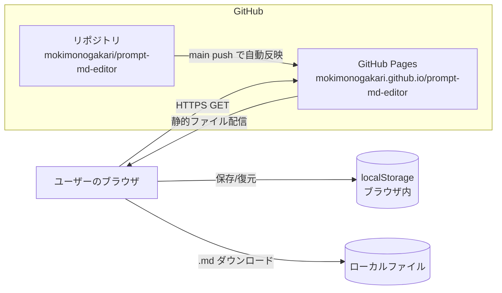

# インフラ構成図

## システム構成

- バックエンド・DB・外部APIは存在しない。全処理がブラウザ内で完結する
- ユーザーの入力内容はサーバーに送信されない（localStorage とダウンロードファイルのみ）

## 環境一覧

| 環境 | URL | ホスティング | 用途 |
|------|-----|-------------|------|
| 本番 | https://mokimonogakari.github.io/prompt-md-editor/ | GitHub Pages | 公開アプリ |
| ローカル | http://localhost:8000 | 任意の静的サーバー | 開発・確認 |

## 使用サービス一覧

| サービス | 用途 | プラン |
|----------|------|--------|
| GitHub | ソース管理 | Free |
| GitHub Pages | 静的ホスティング（TLS込み） | Free（公開リポジトリ） |

## ネットワーク・セキュリティ

- 配信は GitHub Pages の HTTPS（TLS 1.2+）のみ。独自ドメインなし
- CSP を `<meta>` で設定: `default-src 'none'; script-src 'self'; style-src 'self'; img-src 'self' data: https:; connect-src 'none'` — 外部スクリプト・外部送信を遮断
- プレビュー描画は DOMPurify でサニタイズ後に挿入（XSS対策）
- ライブラリはCDN参照ではなくリポジトリ同梱（サプライチェーン・可用性対策、バージョン固定）
- 認証・個人情報の取り扱いなし
